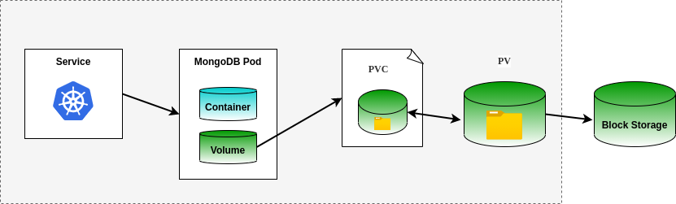

# Simple MongoDB Microservice

## Overview

This is meant to be a simple tutorial as a follow up to the [a Kubernetes load balancer with web servers](https://github.com/msgarbossa/k8s-nginx).  A Mongo container is deployed with persistent storage.  Containerized workloads are ephemeral, meaning the code within them is typically redeployed instead of maintained.  This presents challenges for workloads that need to access the same storage beyond the lifecycle of a container.  The use of persistent storage solves this problem.  The procedure described in this document uses single container deployment and should not be used for production workloads.

## Kubernetes Concepts

The steps below will cover the following:

- Persistent storage
  - persistent volume (pv)
  - persistent volume claim (pvc)
- Get a shell in a running container
- Use a NodePort service to expose a cluster IP
- Importance of software-defined storage integrations with Kubernetes

## Architecture

The diagram below illustrates the heirarchy of the basic storage abstractions used in Kubernetes to allow block storage to be consumed by ephemeral containers for persistent storage.



## Setup simple Kubernetes cluster

There are many options for a simple development cluster in addition to the Mac and Ubuntu examples in the links below.

## Prerequisites

1. Install [MicroK8s](https://microk8s.io/docs/getting-started) (specific steps [here](./assets/microk8s.md)).  [Docker Desktop](https://www.docker.com/products/docker-desktop) can be used on MacOS, but the ingress controller is not needed.
2. It is assumed the Git client is already installed to be able to clone this repository.  Alternatively, the Git repository can be downloaded in a zip or tar file and extracted locally.

## Clone git repo

Clone git repository ([git client](https://git-scm.com/downloads) required) and cd to repo directory.

```
$ git clone https://github.com/msgarbossa/k8s-mongo.git
$ cd k8s-mongo
```

## Setup mongo microservice

For each kubectl apply command, cat the YAML file to see the defined resources.

### Persistent volume

Persistent volumes make Kubernetes supported software-defined storage available to the cluster.  This example uses hostPath mapped to the local /tmp/k8s_dir directory, which is useful for development and testing, but it should not be used in Production.  Cloud-native storage offerings vary between cloud providers.  Cloud providers ensure their storage products are able to integrate with their Kubernetes services.

Create directory for persistent volume and create persistent volume (pv).

Note: If using a different path than /tmp/k8s_dir, update the path entry in mongo-pv.yml with the desired absolute path.  The last portion of the path ("persistentVolume001") will be created automatically if it does not exist.

```
$ mkdir /tmp/k8s_dir
$ kubectl create -f mongo-pv.yml
persistentvolume/pv001 created
```

List persistent volume (pv).

```
$ kubectl get pv
NAME    CAPACITY   ACCESS MODES   RECLAIM POLICY   STATUS      CLAIM   STORAGECLASS   REASON   AGE
pv001   2Gi        RWX            Retain           Available           domain1                 3m53s
```

### Persistent volume claim

Create persistent volume claim (pvc), which will be used to associate the container deployment with the persistent volume.

```
$ kubectl create -f mongo-pvc.yml
persistentvolumeclaim/pv001-claim created
```

List persistent volume claim (pvc).

```
$ kubectl get pvc
NAME          STATUS   VOLUME   CAPACITY   ACCESS MODES   STORAGECLASS   AGE
pv001-claim   Bound    pv001    2Gi        RWX            domain1        5s
```

### Deployment

Create deployment with mongo container and volume mount.

Note: The mongo container is based on Ubuntu and is currently around 380MB.  It may take a minute if the latest container image needs to be pulled.

```
$ kubectl create -f mongo-deployment.yml
deployment.apps/mongo-1 created
```

List deployment.

```
$ kubectl get deploy
NAME      READY   UP-TO-DATE   AVAILABLE   AGE
mongo-1   1/1     1            1           10s
```

The deployment claims the persistent volume, which mounts the local path into the container instance.  The *ls* command shows that the MongoDB process initialized a new database.

```
$ ls -l /tmp/k8s_dir/persistentVolume001/
total 448
-rw-------  1 user123  group123     47 Apr  1 15:54 WiredTiger
-rw-------  1 user123  group123     21 Apr  1 15:54 WiredTiger.lock
-rw-------  1 user123  group123   1209 Apr  1 15:56 WiredTiger.turtle
-rw-------  1 user123  group123  61440 Apr  1 15:56 WiredTiger.wt
-rw-------  1 user123  group123   4096 Apr  1 15:54 WiredTigerLAS.wt
-rw-------  1 user123  group123  20480 Apr  1 15:55 _mdb_catalog.wt
-rw-------  1 user123  group123  20480 Apr  1 15:55 collection-0-2473644892620288049.wt
-rw-------  1 user123  group123  20480 Apr  1 15:55 collection-2-2473644892620288049.wt
-rw-------  1 user123  group123   4096 Apr  1 15:54 collection-4-2473644892620288049.wt
drwx------  4 user123  group123    128 Apr  1 17:45 diagnostic.data
-rw-------  1 user123  group123  20480 Apr  1 15:55 index-1-2473644892620288049.wt
-rw-------  1 user123  group123  20480 Apr  1 15:55 index-3-2473644892620288049.wt
-rw-------  1 user123  group123   4096 Apr  1 15:54 index-5-2473644892620288049.wt
-rw-------  1 user123  group123  12288 Apr  1 15:56 index-6-2473644892620288049.wt
drwx------  5 user123  group123    160 Apr  1 15:54 journal
-rw-------  1 user123  group123      2 Apr  1 15:54 mongod.lock
-rw-------  1 user123  group123  20480 Apr  1 15:56 sizeStorer.wt
-rw-------  1 user123  group123    114 Apr  1 15:54 storage.bson
```

### Bash shell

At this point, the pod was deployed with the container image. Get the pod name to be able to exec a bash shell into the container.  The *-o wide* option was used to get the IP address to compare when the pod is later rescheduled.

```
$ kubectl get pods -o wide
NAME                      READY   STATUS    RESTARTS   AGE   IP             NODE        NOMINATED NODE   READINESS GATES
mongo-1-9c69844cf-wscv7   1/1     Running   0          1m    10.1.232.138   myserver    <none>           <none>
```

The *kubectl exec* command uses almost identical syntax to the *docker exec* command that performs the same function on a Docker host (note the -it for interactive TTY and bash for the command to execute inside the container).

```
$ kubectl exec -it mongo-1-9c69844cf-wscv7 -- bash
root@mongo-1-9c69844cf-wscv7:/#
```

Once inside the bash shell in the container, any executable files available inside the container can be run.

The *df* and *mount* commands below show the persistent volume mounted inside the container instance as specified in the deployment manifest.

```
root@mongo-1-9c69844cf-wscv7:/# df -h /data/db
Filesystem                 Size  Used Avail Use% Mounted on
/dev/mapper/vgubuntu-root  914G  808G   60G  94% /data/db
root@mongo-1-9c69844cf-wscv7:/# mount | grep data
/dev/mapper/vgubuntu-root on /data/db type ext4 (rw,relatime,errors=remount-ro)
/dev/mapper/vgubuntu-root on /data/configdb type ext4 (rw,relatime,errors=remount-ro)
```

Run *mongo* to login to mongo.  The example below shows the *db.version()* command to list the version of Mongo and *db* to list the current database.  Once done, type *exit* to exit the mongo shell and *exit* again to exit the bash shell (or press Ctrl-D).

```
root@mongo-1-9c69844cf-wscv7:/# mongosh
Current Mongosh Log ID:	61be2aff5694211029b13b28
Connecting to:		mongodb://127.0.0.1:27017/?directConnection=true&serverSelectionTimeoutMS=2000
Using MongoDB:		5.0.5
Using Mongosh:		1.1.6

For mongosh info see: https://docs.mongodb.com/mongodb-shell/
...
---

test> db.version()
5.0.5
test> db
test
test> exit
root@mongo-1-9c69844cf-wscv7:/# exit
$
```

### Service with nodePort

With the pod deployed, the container is not accessible outside the cluster.  The netstat command below at the host-level does not see the container port (no output).

```
$ netstat -an | grep 27017
$
```

With the deployment resource, Kubernetes will ensure the pod is running on a node in the cluster.  If the pod is destroyed, it is rescheduled and it is likely the IP address for the pod will change.  The solution for this problem is to add a service, which gives a consistent IP address to connect to one or more pods, regardless of the node it is running on.  In this example, a NodePort service is created.  NodePort is the simplest option to expose a service and is only suitable for development purposes.  One limitation is the local nodePort must be within a specific range (30000-32767).  The example below uses TCP/30163 for the local port.  If a nodePort is not specified, a random port number within the port range will be allocated.

```
$ kubectl create -f mongo-service.yml
service/mongo created
```

Get services.

```
$ kubectl get svc
NAME         TYPE        CLUSTER-IP       EXTERNAL-IP   PORT(S)           AGE
kubernetes   ClusterIP   10.96.0.1        <none>        443/TCP           32h
mongo        NodePort    10.103.250.187   <none>        27017:30163/TCP   3m44s
```

Check port is listening on the host.

```
$ netstat -an | grep 30163
tcp        0      0 0.0.0.0:30163           0.0.0.0:*               LISTEN 
```

### Pod scheduling

Deleting a pod causes the pod deployment to be rescheduled.  Notice the pod name and the IP address changed.  The service is still connected to the pod.

```
$ kubectl delete pod mongo-1-9c69844cf-wscv7
pod "mongo-1-9c69844cf-wscv7" deleted
$ kubectl get pods
NAME                      READY   STATUS              RESTARTS   AGE
mongo-1-9c69844cf-fvd7v   0/1     ContainerCreating   0          7s
$ sleep 10
$ kubectl get pods
NAME                      READY   STATUS    RESTARTS   AGE
mongo-1-9c69844cf-fvd7v   1/1     Running   0          18s
$ kubectl get pods -o wide
NAME                      READY   STATUS    RESTARTS   AGE   IP             NODE        NOMINATED NODE   READINESS GATES
mongo-1-9c69844cf-fvd7v   1/1     Running   0          48s   10.1.232.139   myserver    <none>           <none>
```

Even though the original pod was deleted, the newly created pod uses the same persistent storage (files have timestamps from before and after the pod was destroyed).

```
$ ls -l /tmp/k8s_dir/persistentVolume001/
total 424
-rw-------@ 1 user123  group123     47 Apr  1 15:54 WiredTiger
-rw-------@ 1 user123  group123     21 Apr  1 15:54 WiredTiger.lock
-rw-------  1 user123  group123   1207 Apr  1 19:44 WiredTiger.turtle
-rw-------@ 1 user123  group123  49152 Apr  1 19:44 WiredTiger.wt
-rw-------  1 user123  group123   4096 Apr  1 19:44 WiredTigerLAS.wt
-rw-------@ 1 user123  group123  20480 Apr  1 19:44 _mdb_catalog.wt
-rw-------@ 1 user123  group123  20480 Apr  1 19:44 collection-0-2473644892620288049.wt
-rw-------@ 1 user123  group123  20480 Apr  1 19:44 collection-2-2473644892620288049.wt
-rw-------@ 1 user123  group123   4096 Apr  1 19:44 collection-4-2473644892620288049.wt
drwx------@ 3 user123  group123     96 Apr  1 19:44 diagnostic.data
-rw-------@ 1 user123  group123  20480 Apr  1 19:44 index-1-2473644892620288049.wt
-rw-------@ 1 user123  group123  20480 Apr  1 19:44 index-3-2473644892620288049.wt
-rw-------@ 1 user123  group123   4096 Apr  1 19:44 index-5-2473644892620288049.wt
-rw-------@ 1 user123  group123  12288 Apr  1 19:44 index-6-2473644892620288049.wt
drwx------@ 5 user123  group123    160 Apr  1 19:44 journal
-rw-------@ 1 user123  group123      2 Apr  1 19:44 mongod.lock
-rw-------@ 1 user123  group123  20480 Apr  1 19:44 sizeStorer.wt
-rw-------@ 1 user123  group123    114 Apr  1 15:54 storage.bson
```

### Port forwarding

(optional)

For simple development and testing purposes, an alternative to creating a service with NodePort is to use *kubectl port-forward*, which can forward a local host port to a cluster IP for a pod or a service (when a port is not exposed through the service).  The port forward will eventually timeout and should not be relied on for ongoing usage.  This example forwards the host port to the pod.

Get pod name for use in the port forward command.

```
$ kubectl get pods
NAME                       READY   STATUS    RESTARTS   AGE
mongo-1-85d577798b-69jpv   1/1     Running   0          22m
```

Forward local port 27017 to pod port 27017 (local-port:pod-port)

```
$ kubectl port-forward pod/mongo-1-85d577798b-69jpv 27017:27017&
[1] 31753
$ Forwarding from 127.0.0.1:27017 -> 27017
Forwarding from [::1]:27017 -> 27017

$ netstat -an | grep 27017
tcp6       0      0  ::1.27017              *.*                    LISTEN
tcp4       0      0  127.0.0.1.27017        *.*                    LISTEN
$ fg
kubectl port-forward pod/mongo-1-85d577798b-drbbn 27017:27017
[Ctrl-C]
```

## Cleanup

When done testing, the Mongo resources can be removed in the order they were deployed.

```
$ kubectl delete -f mongo-service.yml
service "mongo" deleted
$ kubectl delete -f mongo-deployment.yml
deployment.apps "mongo-1" deleted
$ kubectl delete -f mongo-pvc.yml
persistentvolumeclaim "pv001-claim" deleted
$ kubectl delete -f mongo-pv.yml
persistentvolume "pv001" deleted
```

Remove the MongoDB data that was stored in the persistent volume directory.

```
$ rm -rf /tmp/k8s_dir
```

Having a local Kubernetes cluster running seems to slightly increase resource utilization on a Mac.  It can be disabled by unchecking the button in the configuration tool used to enable Kubernetes.

## Notes

- The [./python](./python) directory contains simple Python scripts that use pymongo for CRUD (Create, Read, Update, Delete) operations
- See [./python/README.md](./python/README.md) for details on how to setup a python virtualenv
- As mentioned earlier, a proper Mongo deployment in Kubernetes should use replicas for redundancy and could be setup to be fault tolerant and scalable

## References and Links

Kubernetes tutorial using Docker CE for Mac:
https://rominirani.com/tutorial-getting-started-with-kubernetes-with-docker-on-mac-7f58467203fd

Kubernetes documentation for setting up a service:
https://kubernetes.io/docs/concepts/services-networking/connect-applications-service/

Running MongoDB as a Microservice with Docker and Kubernetes:
https://www.mongodb.com/blog/post/running-mongodb-as-a-microservice-with-docker-and-kubernetes

A Deployment that configures a ReplicaSet is now the recommended way to set up replication (old examples use replication controller):
https://kubernetes.io/docs/concepts/workloads/controllers/replicationcontroller/

Basic MongoDB tutorial:
https://www.tutorialspoint.com/mongodb/index.htm

PyMongo:
https://docs.mongodb.com/ecosystem/drivers/python/

PyMongo insert documents:
https://realpython.com/introduction-to-mongodb-and-python/
